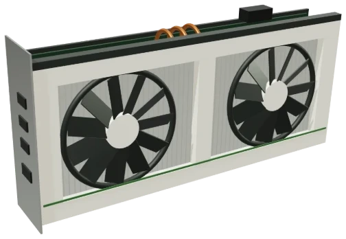
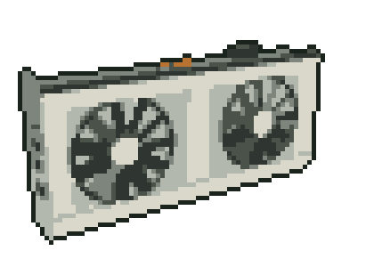

# 3d-pixelated-gpu

A 3D GPU, but in pixels. Made for [aalquwayfili.com](https://aalquwayfili.com).

<table>
  <tr><th>Original</th><th>Pixelated</th></tr>
  <tr>
    <td></td>
    <td></td>
  </tr>
</table>

[`gpu.js`](gpu.js) builds the card from boxes, rings and tubes in [three.js](https://threejs.org), renders it from 24 angles, and turns each frame into pixel art: 84×60, a 9-colour palette, and a 1px outline.

MIT
